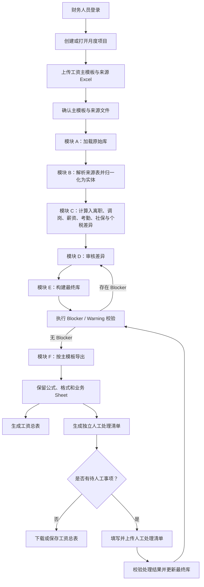

# 月度薪资处理流程

## 主流程

## 处理原则

1. 总表是目标工作簿和 Sheet 结构的权威来源。
2. 来源 Sheet 先按内容语义、字段、样例数据和人员标识判断主题；Sheet 名仅作弱提示。
3. 主题、人员、字段和来源优先级均唯一时，系统直接更新目标总表。
4. 身份冲突、多个候选主题、字段映射不唯一或同优先级值冲突时，才生成独立人工事项。
5. 人工事项必须带来源文件、Sheet、行号、候选值、匹配依据和处理结果；人工确认后回流到最终库。
6. Blocker 阻断导出，Warning 仅提示业务人员关注。

## 结果物

| 文件 | 用途 |
| --- | --- |
| 工资核算总表 | 正式业务交付物，保留主模板的公式、格式和需要保留的业务 Sheet。 |
| 待人工处理清单 | 独立的可回传工作簿，记录无法自动确认的事项；不再嵌入工资总表。 |

## 待完成的流程增强

通用语义 Sheet 归并将补齐主题画像、唯一高置信评分、自动映射与最小人工兜底。其具体验收见 [语义 Sheet 归并规格](semantic-sheet-integration-spec.md)。
